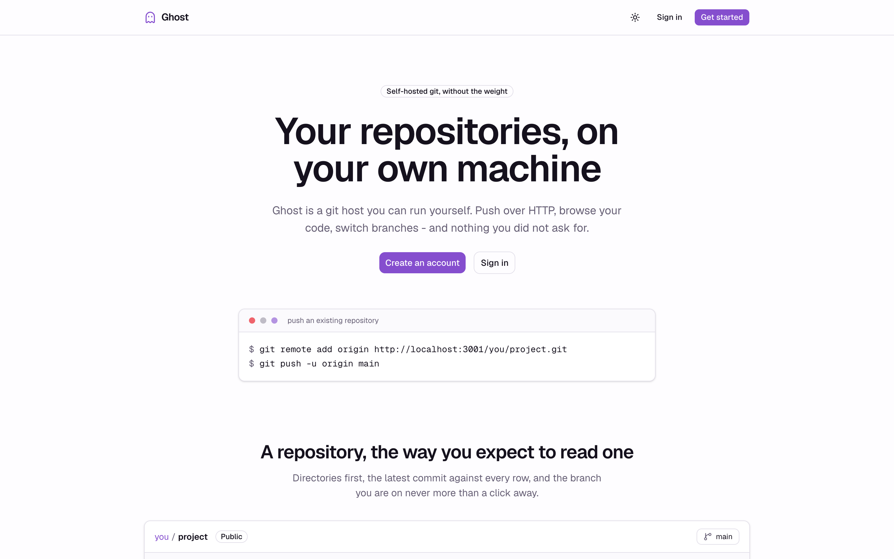
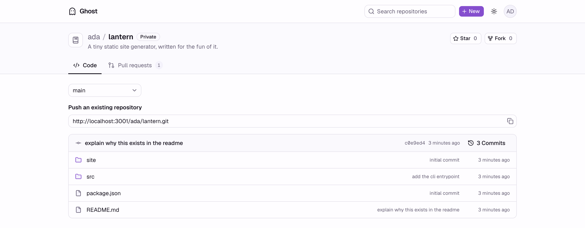
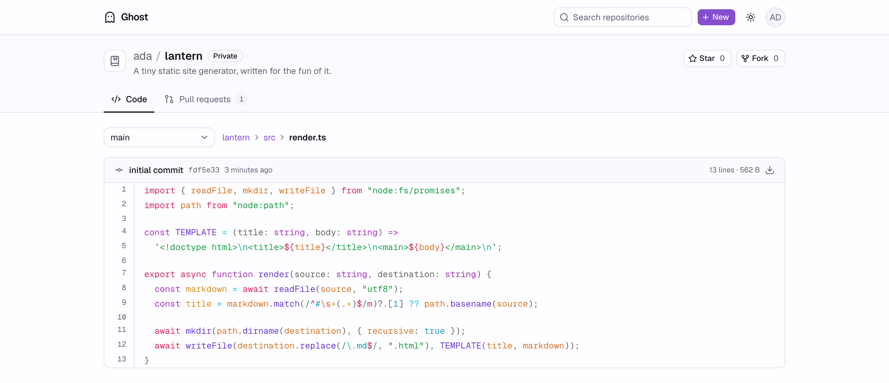
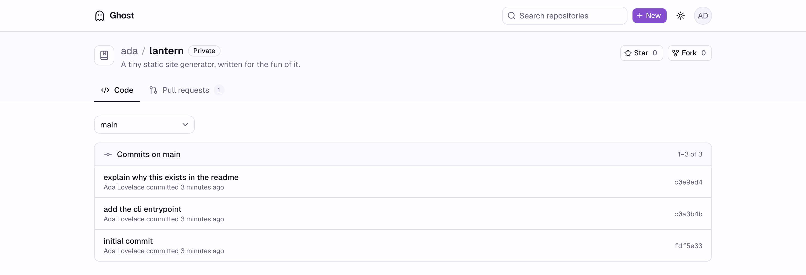
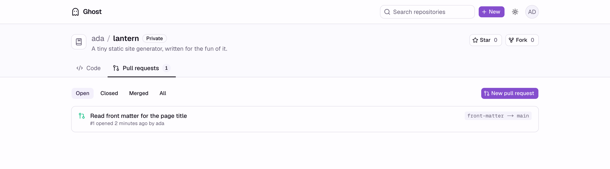
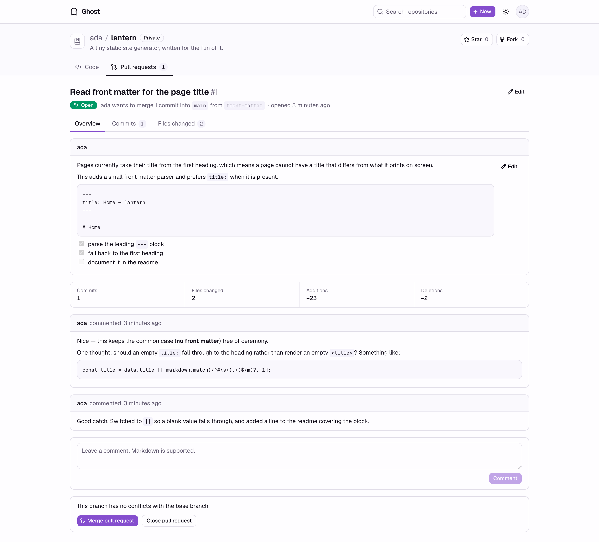
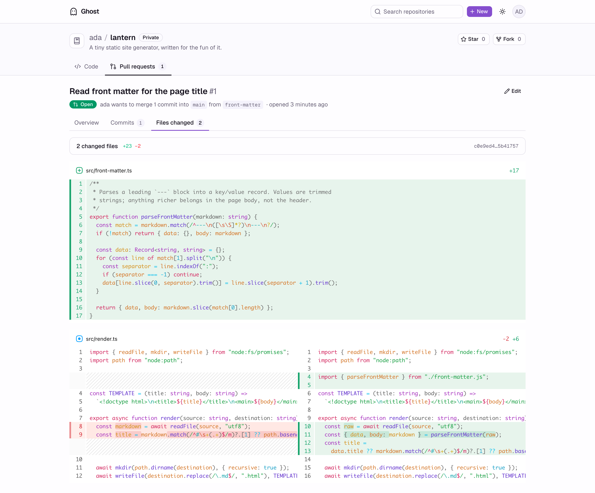

<h1 align="center">
    Ghost
</h1>

<p align="center">A git hosting platform</p>



> [!Note]
> This is just an engineering reproduction and should not be trusted with actual data(yet).

Self-hosted git. Push over HTTP, browse the code, open pull requests, review the
diff, merge. Object storage holds the truth, local disk is a cache.

## Screens

Repository listing. Directories first, last commit per row, branch switcher.



File view with syntax highlighting and a raw download.



Commit history for any branch.



Pull request list, filtered by state. Open count sits on the tab.



Pull request overview: markdown description, comments, live merge state. Author
or anyone with write access can edit the title and description in place.



Split diff, computed from the merge base rather than the branch tips.



## Features

- Push and pull over HTTP, authenticated with a personal access token
- Trees, blobs, raw files, branch switching, commit history
- Forks, stars, public and private repositories
- Pull requests across branches and across forks, with a real merge commit
- Comments with markdown, editable title and description
- Issues with comments, timeline events, labels, assignees, search and filters
- Accounts, sessions, organizations, API keys (better-auth)

Not built yet: webhooks, CI.

## Stack

| Layer    | Choice                                                |
| -------- | ----------------------------------------------------- |
| Web      | Next.js 16, React 19, Tailwind, shadcn/ui             |
| API      | NestJS 12, OpenAPI client generated for the web       |
| Database | Postgres, Drizzle                                     |
| Storage  | S3-compatible bucket (RustFS locally)                 |
| Runtime  | Bun, Turborepo workspace                              |

## Running it

Needs Bun and Docker.

```sh
docker compose up -d      # Postgres, RustFS, and the ghost bucket
bun install
cp .env.example .env      # set BETTER_AUTH_SECRET, the rest matches compose
bun run db:migrate
bun run dev
```

Web on `http://localhost:3000`, API on `http://localhost:3001`, RustFS console
on `http://localhost:9001`.

Push an existing repository. The password is a personal access token from
account settings, not the login password.

```sh
git remote add origin http://localhost:3001/<username>/<repo>.git
git push -u origin main
```

## Layout

```
apps/api      NestJS API and the git HTTP transport
apps/web      Next.js frontend
packages/db   Drizzle schema and migrations
docs/         Design decisions, one file each
```

## Design decisions

[`docs/`](docs/README.md) covers why the transport takes streams instead of
`Request`/`Response`, why a push is one compare-and-swap against a write-ahead
log, why materialization is forward-only replay, and why a pull request spans
two logs and lends objects instead of copying them. Each file lists what was
rejected and what it costs.
