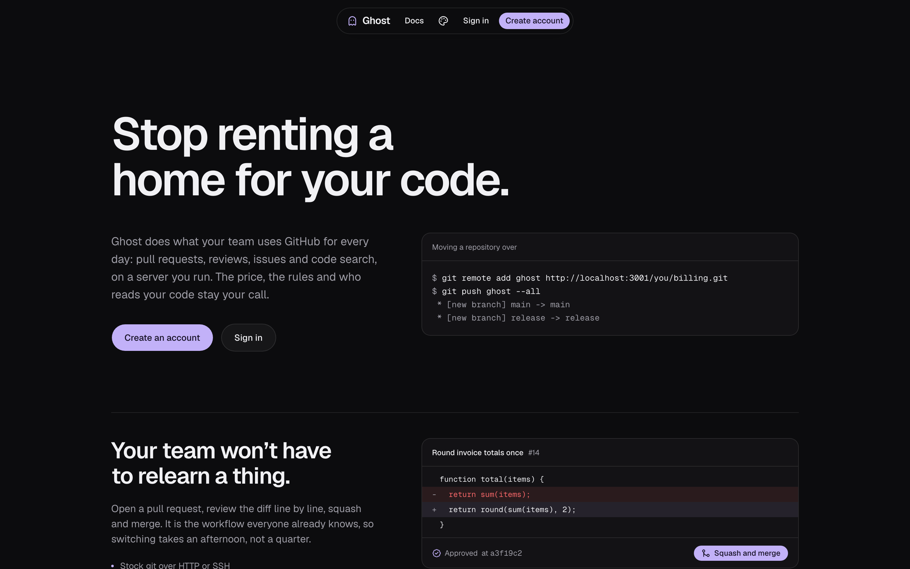
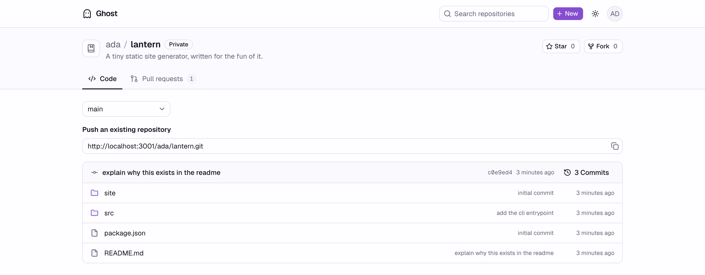
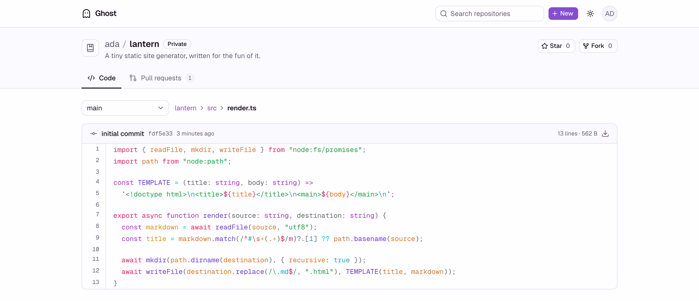
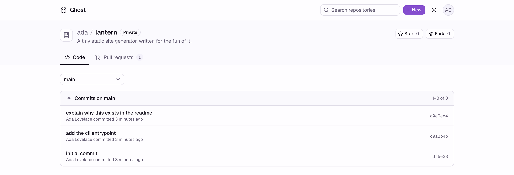
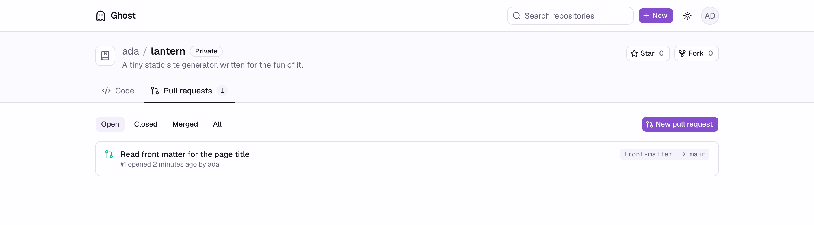
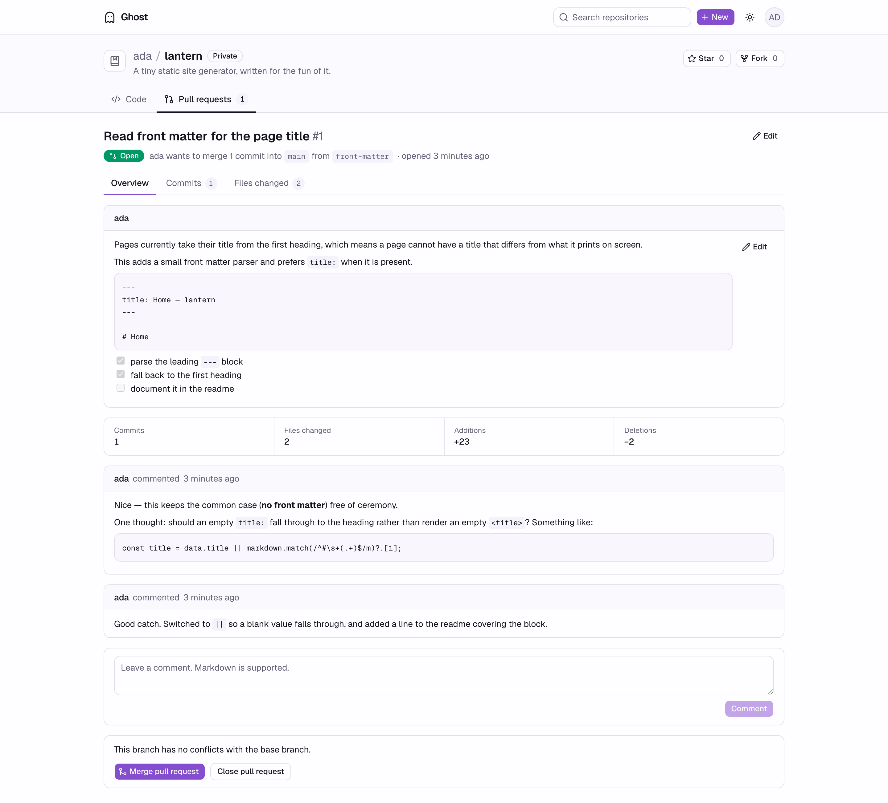
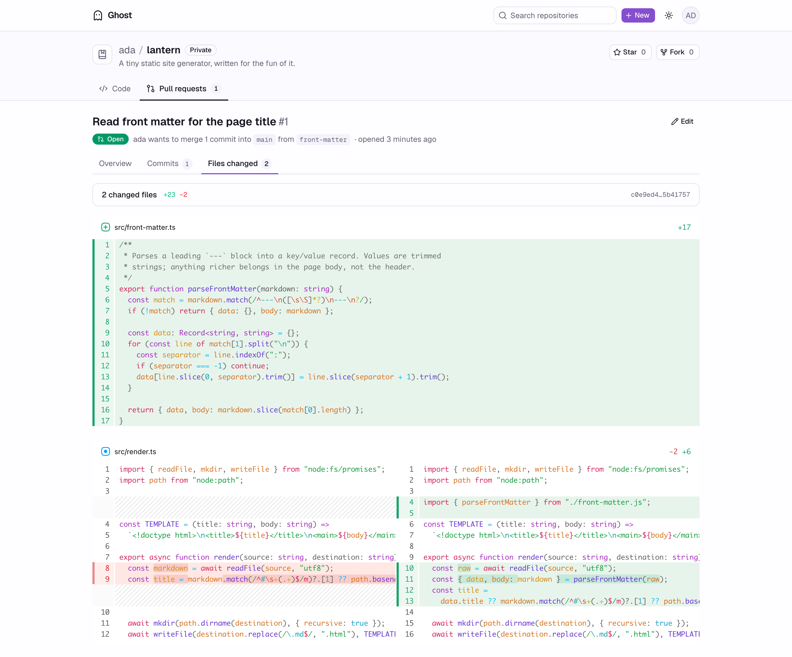

<h1 align="center">
    Ghost
</h1>

<p align="center">A git hosting platform</p>



Self-hosted git. Push over HTTP or SSH, browse the code, open pull requests,
review the diff, merge. Object storage holds the truth, local disk is a cache.

## Screens

Repository listing. Directories first, last commit per row, branch switcher.



File view with syntax highlighting and a raw download.



Commit history for any branch.



Pull request list, filtered by state. Open count sits on the tab.



Pull request overview: markdown description, comments, live merge state. Author
or anyone with write access can edit the title and description in place.



Split diff, computed from the merge base rather than the branch tips.



## Features

- Push and pull over HTTP with a personal access token, or over SSH with a key on the account
- Every push saved to an S3-compatible bucket first; the local disk is a cache that can be rebuilt
- Trees, blobs, raw files, READMEs, branch switching, commit history, language breakdown
- Code search across every repository you can read, indexed on push (Zoekt)
- Pull requests across branches and forks: split diff from the merge base, reviews pinned to the head they read, merge commit, squash or rebase
- Issues with comments, labels, assignees, timeline events, `#123` cross references, search and filters
- Tags and releases, forks, stars, contributors
- Organizations, teams and outside collaborators, with read, triage, write, maintain and admin roles
- GPG-signed commits shown as verified against keys an account uploads
- Accounts, sessions, multiple emails, API keys, notifications, contribution graph
- Themes, including a custom one, and a docs site
- Works with the GitHub CLI: point `GH_HOST` at the API host for `gh repo`, `gh issue` and `gh api`

Not built yet: webhooks (in progress), Git LFS, CI.

## Stack

| Layer    | Choice                                                |
| -------- | ----------------------------------------------------- |
| Web      | Next.js 16, React 19, Tailwind, shadcn/ui             |
| API      | NestJS 12, OpenAPI client generated for the web       |
| Database | Postgres, Drizzle                                     |
| Storage  | S3-compatible bucket (RustFS locally)                 |
| Search   | Zoekt                                                 |
| Runtime  | Bun, Turborepo workspace                              |

## Self-hosting

Needs Docker. The script asks for a domain (or IP), an SMTP server or email
relay, and where to store data; it generates every secret you skip.

```sh
./docker/setup.sh                                           # macOS / Linux
powershell -ExecutionPolicy Bypass -File docker\setup.ps1   # Windows
```

Full guide: [`apps/docs/content/docs/self-hosting/index.mdx`](apps/docs/content/docs/self-hosting/index.mdx).

## Running it for development

Needs Bun and Docker.

```sh
docker compose up -d      # Postgres, RustFS, and the ghost bucket
bun install
cp .env.example .env      # set BETTER_AUTH_SECRET, the rest matches compose
bun run db:migrate
bun run dev
```

Web on `http://localhost:3000`, API on `http://localhost:3001`, RustFS console
on `http://localhost:9001`.

Push an existing repository. The password is a personal access token from
account settings, not the login password.

```sh
git remote add origin http://localhost:3001/<username>/<repo>.git
git push -u origin main
```

For SSH, give the API a host key and add your public key under
**Settings → Security**:

```sh
ssh-keygen -t ed25519 -N '' -f ghost_host_key
echo "GIT_SSH_HOST_KEY=$(base64 -i ghost_host_key)" >> .env
git remote set-url origin ssh://git@localhost:1031/<username>/<repo>.git
```

Without `GIT_SSH_HOST_KEY` the listener never starts and git speaks HTTP only.

## Layout

```
apps/api      NestJS API and the git HTTP transport
apps/web      Next.js frontend
apps/docs     Fumadocs user guide, e.g. how to sign commits (port 3003)
packages/db   Drizzle schema and migrations
docker/       Self-hosting: compose file, Caddyfile, setup scripts
docs/         Design decisions, one file each
```

## User guide

[`apps/docs`](apps/docs) is the guide for people using an instance: how to
generate an SSH key and connect with it, what the Verified badge on a commit
means, how to generate a GPG key, add it to an account, configure git to sign,
and what each failure message means. Run it
with `bun run dev` alongside everything else, or on its own:

```bash
bun run --filter @ghost/docs dev
```

## Code standards

[`docs/code-standards.md`](docs/code-standards.md) is the contract for contributions: DRY and SOLID, no DTO reshaping helpers, no concatenated strings, comments that explain why and fit on one line, and `services/` holding nothing but services.

## Design decisions

[`docs/`](docs/README.md) covers why the transport takes streams instead of
`Request`/`Response`, why a push is one compare-and-swap against a write-ahead
log, why materialization is forward-only replay, and why a pull request spans
two logs and lends objects instead of copying them. Each file lists what was
rejected and what it costs.
